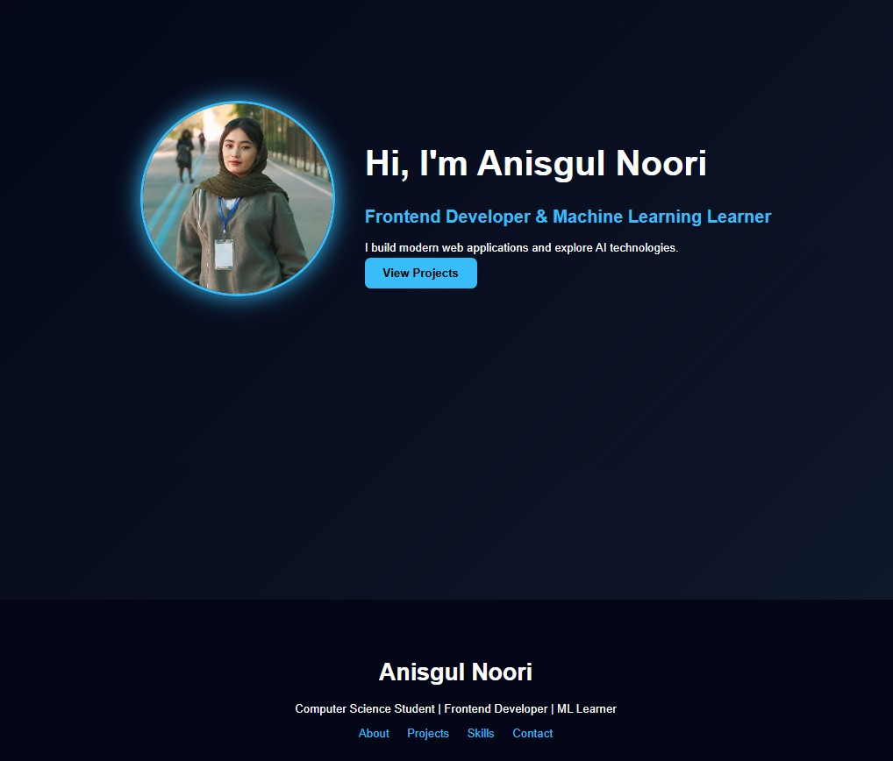

  
\#  Anisgul Noori Portfolio

Personal portfolio website showcasing my projects, skills, and learning journey in \*\*Frontend Development\*\* and \*\*Machine Learning\*\*.

\#\#  About Me

Computer Science student passionate about:

\- Frontend Development  
\- UI/UX Design  
\- Machine Learning  
\- Building modern web experiences

\#\#  Live Website

 https://anisnoori.github.io/portfolio/

\#\#  Tech Stack

\- HTML5  
\- CSS3  
\- JavaScript  
\- Git & GitHub  
\- Responsive Design

\#\# Featured Projects

\- \*\*Umeed Afghanistan\*\*  
\- \*\*Mini Shop\*\*  
\- \*\*Beautiful Afghanistan\*\*

\#\# Preview

\#\#  Run Locally

\`\`\`bash  
git clone https://github.com/anisnoori/portfolio.git  
cd portfolio  
open index.html

##  **Contact**

Email: anisgulnoori93@gmail.com

GitHub: [https://github.com/anisnoori](https://github.com/anisnoori)

 Built with passion & curiosity ♥

